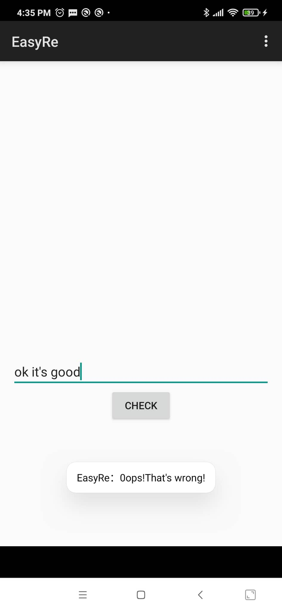
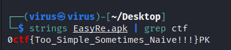
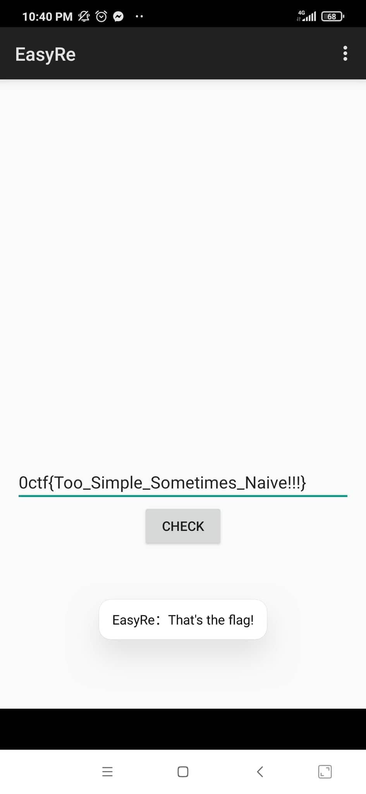
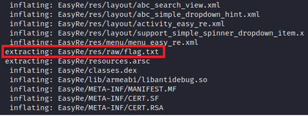
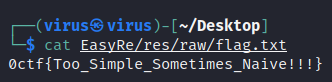

# EasyRe

## Analysis:

Ta xem chức năng và hành vi ứng dụng

<p align="center"></p>

Nhập vào chuỗi và in ra thông báo => Không có gì lạ. Ta sẽ reverse file APK

Decompile bằng **Jadx**. Đọc file `AndroidManifest.xml`:

```xml
<?xml version="1.0" encoding="utf-8"?>
<manifest xmlns:android="http://schemas.android.com/apk/res/android" android:versionCode="1" android:versionName="1.0" package="easyre.sjl.gossip.easyre" platformBuildVersionCode="21" platformBuildVersionName="5.0.1-1624448">
    <uses-sdk android:minSdkVersion="15" android:targetSdkVersion="21"/>
    <application android:theme="@style/AppTheme" android:label="@string/app_name" android:icon="@drawable/ic_launcher" android:debuggable="true" android:allowBackup="true">
        <activity android:label="@string/app_name" android:name="easyre.sjl.gossip.easyre.EasyRe">
            <intent-filter>
                <action android:name="android.intent.action.MAIN"/>
                <category android:name="android.intent.category.LAUNCHER"/>
            </intent-filter>
        </activity>
    </application>
</manifest>
```

Activity chính là **EasyRe** thuộc package `easyre.sjl.gossip.easyre`. Kiểm tra hoạt động chính hàm **onClick** trong **EasyRe**:

```java
public void onClick(View view) {
        String flag = "";
        try {
            FileInputStream fin = openFileInput("flag.txt");
            int length = fin.available();
            byte[] buffer = new byte[length];
            fin.read(buffer);
            flag = EncodingUtils.getString(buffer, "UTF-8");
        } catch (Exception e) {
            e.printStackTrace();
        }
        if (flag.equals(this.et1.getText().toString())) {
            Toast.makeText(getApplicationContext(), "That's the flag!", 0).show();
        } else {
            Toast.makeText(getApplicationContext(), "0ops!That's wrong!", 0).show();
        }
    }
```

Chuỗi input nhập vào sẽ được kiểm tra với chuỗi được lấy từ *flag.txt*. Nếu đúng thì in ra "That's the flag!" còn không thì trả về "0ops!That's wrong!"

## Solution:

### Cách 1 (Dùng `strings`):

Có thể **flag** được **hardcoded** trong chương trình nên ta có thể lấy ra như một chuỗi đọc được:

```bash
strings EasyRe.apk | grep ctf
```

<p align="center"></p>

Kiểm tra flag:

<p align="center"></p>

### Cách 2 (Extract):

APK không các gì các file zip chứa resource và assembled java code. Vậy nên nếu không cần phân tích quá phức tạp vào các file logic, ta có thể extract file và xem content các file cấu thành của ứng dụng. Dùng `unzip`:

```bash
unzip EasyRe.apk -d EasyRe
```

<p align="center"></p>

Có file `flag.txt`. Thử đọc flag tại đây:

```bash
cat EasyRe/res/raw/flag.txt
```

<p align="center"></p>


Flag: **0ctf{Too_Simple_Sometimes_Naive!!!}**