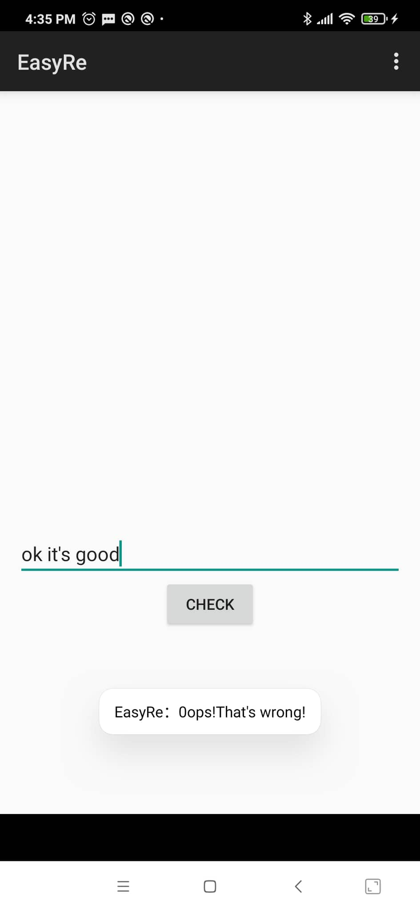
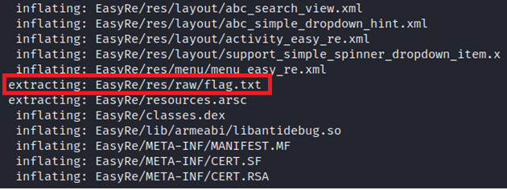
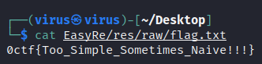

# EasyRe

## Analysis:

Ta xem chức năng và hành vi ứng dụng

<p align="center"></p>

Nhập vào chuỗi và in ra thông báo => Không có gì lạ. Ta sẽ reverse file APK

## Solution:

### Cách 1 (Dùng `strings`):

Có thể **flag** được **hardcoded** trong chương trình nên ta có thể lấy ra như một chuỗi đọc được:

```bash
strings EasyRe.apk | grep ctf
```

<p align="center"></p>

### Cách 2 (Extract):

APK không các gì các file zip chứa resource và assembled java code. Vậy nên nếu không cần phân tích quá phức tạp vào các file logic, ta có thể extract file và xem content các file cấu thành của ứng dụng. Dùng `unzip`:

```bash
unzip EasyRe.apk -d EasyRe
```

<p align="center"></p>

Có file `flag.txt`. Thử đọc flag tại đây:

```bash
cat EasyRe/res/raw/flag.txt
```

<p align="center"></p>


Flag: **0ctf{Too_Simple_Sometimes_Naive!!!}**