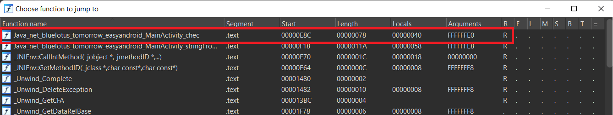
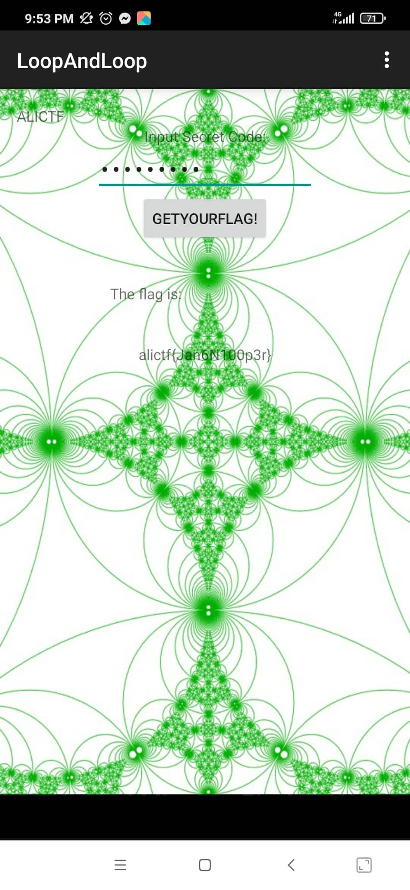

# LoopAndLoop

## Analysis:

Ta có App như sau:

<p align="center"></p>

Decompile bằng **Jadx**. Như thông lệ, đọc file `AndroidManifest.xml`, ta quan tâm đến hàm chính **onClick()**:

```java
public void onClick(View v) {
                String in_str = ed.getText().toString();
                try {
                    int in_int = Integer.parseInt(in_str);
                    if (MainActivity.this.check(in_int, 99) == 1835996258) {
                        tv1.setText("The flag is:");
                        tv2.setText("alictf{" + MainActivity.this.stringFromJNI2(in_int) + "}");
                        return;
                    }
                    tv1.setText("Not Right!");
                } catch (NumberFormatException e) {
                    tv1.setText("Not a Valid Integer number");
                }
            }
```

Ở đây ta thấy chương trình chính khá đơn giản. Chuỗi chúng ta nhập vào được *parse* thành kiểu *Int*, nếu chuỗi nhập vào không có định dạng số thì sẽ bắt (catch) Exception và in ra message "Not a Valid Integer number"

Số nhập vào sẽ được kiểm tra bằng hàm `check` với đối số đầu là input `in_int` và đối số thứ 2 là một số cố định `99`. Nếu input vượt qua hàm kiểm tra và bằng giá trị `1835996258` thì sẽ in ra flag, còn không thì trả về "Not a Valid Integer number".

Xem tiếp hàm `check`:

```java
public int check(int input, int s) {
        return chec(input, s);
    }
```

Hàm này lại gọi hàm `chec`. Mà hàm này thì ối dồi ôi, nó nhọ ... là một hàm native:

```java
public native int chec(int i, int i2);
```
Và đồng thời chương trình chính cũng import thư viện native vào:

```java
System.loadLibrary("lhm");
```

Dùng lệnh `unzip` trên linux lên file apk và lấy file thư viện **.so** bỏ vào IDA để decompile và đọc mã. File này được biên dịch động (dynamically linked), và như đoạn code trên file thư viện được import vào trực tiếp, nên hàm `chec` cũng được include trong này luôn: 

<p align="center"></p>

Hàm `chec`:

```c
int __fastcall Java_net_bluelotus_tomorrow_easyandroid_MainActivity_chec(int a1, int a2, int a3, int a4)
{
  int v5; // r7
  int result; // r0
  int v10[9]; // [sp+1Ch] [bp-24h] BYREF

  v5 = (*(int (__fastcall **)(int, const char *))(*(_DWORD *)a1 + 24))(
         a1,
         "net/bluelotus/tomorrow/easyandroid/MainActivity");
  v10[0] = _JNIEnv::GetMethodID(a1, v5, "check1", "(II)I");
  v10[1] = _JNIEnv::GetMethodID(a1, v5, "check2", "(II)I");
  v10[2] = _JNIEnv::GetMethodID(a1, v5, "check3", "(II)I");
  if ( a4 - 1 <= 0 )
    result = a3;
  else
    result = _JNIEnv::CallIntMethod(a1, a2, v10[2 * a4 % 3], a3, a4 - 1);
  return result;
}
```

Giải thích một xíu, tại sao hàm `chec` lại nhận 4 tham số mà trong khi trong định nghĩa ta thấy hàm chỉ có tham số. Vấn đề này liên quan đến [JNI Interface Functions](https://docs.oracle.com/javase/7/docs/technotes/guides/jni/spec/design.html), ở trong link tham khảo có đề cập đến:

<p align="center"></p>

> Cho thông tin thêm: Nghĩa là 2 tham số đầu : a1 - một con trỏ pointer trỏ đến một con trỏ, con trỏ này lại trỏ đến một mảng các con trỏ trỏ đến các **Interface functions** khác được định nghĩa sẵn để sử dụng. a2 - một tham chiếu đến object hiện tại (nếu được khai báo non-static) hoặc là một tham chiếu đến chính lớp hiện tại thay vì object (nếu được khai báo static)

OK và các tham số còn lại là các tham số đã được định nghĩa như ta biết. Bỏ qua mấy thứ lằng nhằng phía trên một chút, vậy ta biết `a3` và `a4` là 2 tham số thực sự tương ứng với `i` và `i2` sẽ được code hàm xử lý. Giờ mình "take deep" vào nội dung chính của hàm tại đây:

> Note: Mấy biến local như `v5` thường khi sử dụng lẻ loi như trên sẽ không có tác dụng gì. Tập trung vào code chính.
```C
  v10[0] = _JNIEnv::GetMethodID(a1, v5, "check1", "(II)I");
  v10[1] = _JNIEnv::GetMethodID(a1, v5, "check2", "(II)I");
  v10[2] = _JNIEnv::GetMethodID(a1, v5, "check3", "(II)I");
  if ( a4 - 1 <= 0 )
    result = a3;
  else
    result = _JNIEnv::CallIntMethod(a1, a2, v10[2 * a4 % 3], a3, a4 - 1);
  return result;
```
Tham khảo các [Hàm JNI](https://docs.oracle.com/javase/7/docs/technotes/guides/jni/spec/functions.html)
- Hàm `_JNIEnv::GetMethodID` sẽ lấy ID của hàm ... ví dụ tên là `check1`.  
- Hàm `_JNIEnv::CallIntMethod` sẽ lấy ID trên, lấy các tham số (vị trí 4 và 5) làm giá trị xử lý chương trình cho hàm `check1`, còn tham số 1 và 2 chỉ là thủ tục (không cần quan tâm ) vì mình sẽ trỏ đến interface (tham số thứ 1) và tham chiếu đến object (tham số thứ 2)

Tóm gọn lại phương thức trên sẽ chọn và gọi hàm tùy theo giá trị `a4 - 1`, và các hàm được lưu trong mảng biến `v10` và gọi hàm theo chỉ số (index) theo công thức `2 * a4 % 3` (tức là sẽ nhảy vào hàm `check1`, `check2` hoặc `check3` ).

```java
public int check1(int input, int s) {
        int t = input;
        for (int i = 1; i < 100; i++) {
            t += i;
        }
        return chec(t, s);
    }

    public int check2(int input, int s) {
        int t = input;
        if (s % 2 == 0) {
            for (int i = 1; i < 1000; i++) {
                t += i;
            }
            return chec(t, s);
        }
        for (int i2 = 1; i2 < 1000; i2++) {
            t -= i2;
        }
        return chec(t, s);
    }

    public int check3(int input, int s) {
        int t = input;
        for (int i = 1; i < 10000; i++) {
            t += i;
        }
        return chec(t, s);
    }
```

Mà 3 hàm check này cũng lại gọi đến hàm `chec` với đối số `s` giảm dần. Điều kiện dừng khi `s - 1 <=0` (`s` là `a4`). Mô phòng lại hàm `chec` 

```python
def chec(input, s):
    if s - 1 <= 0:
        result = input
    else:
        if 2 * s % 3 == 0:
            result = check1(input, s - 1)
        if 2 * s % 3 == 1:
            result = check2(input, s - 1)
        if 2 * s % 3 == 2:
            result = check3(input, s - 1) 
    return result
```

Vậy để ta pass được hàm `check` thì ta có thể xây dựng lại chương trình và vét cạn (brute-force) input cho tới khi kết quả bằng `1835996258`.

## Solution:

Challenge này có 2 phương án giải quyết:

- Đọc, phân tích, quay lui đệ quy đoạn code và tìm tương quan phân tích giá trị tổng/hiệu được cộng dồn để làm sao đó giá trị trả về là `1835996258` => Cái này mình thấy quá khó đối với mình => Bỏ
- Xây dựng lại chương trình => Vét cạn giá trị đầu vào => Khả thi. Bởi mình biết trong **C/C++** có khả năng *optimize* code tự động khi biên dịch khá là *Vipp Pro* => Giảm thời gian vét.

Đầu tiên để cho tiện và dễ hình dung, mình thường bắt tay xây dựng lại chương trình bằng Python cộng với hàm `chec` ở trên:

```python
def check(input, s):
    return chec(input, s)

def check1(input, s):
    t = input
    t += 4950
    return chec(t, s)

def check2(input, s):
    t = input
    if s % 2 == 0:
        t += 499500
        return chec(t, s)
    t -= 499500
    return chec(t, s)

def check3(input, s):
    t = input
    t += 49995000
    return chec(t, s)
```

Sau đó ta thực hiện brute-force số đầu vào từ **0** và tăng dần lên vô hạn, khi nào đúng thì dừng chương trình và in ra kết quả, thời gian chạy:

```python
in_int = 236492000
start_time = time.time()

while (1):
    if check(in_int, 99) == 1835996258:
        print("The correct value is: " + str(in_int))
        stop_time = time.time()
        print("Execution time: " + str(stop_time - start_time))
        break
    else:
        print("Try: " + str(in_int))
        in_int += 1
```

Chương trình trên chạy khá lâu, thực ra là cực kỳ lâu :3 (Estimated time theo mình tính xấp xỉ 45 ngày). Vậy thì làm sao mình có thể chạy chương trình hiệu quả hơn ? (Xem phần tiếp theo hoặc bỏ qua đều được, vì C/C++ tối ưu hơn code python)

### Tối ưu code trên Python :

Như ta thấy code python trên cực kỳ nặng khi đưa vào tính toán thực tế vì có các hàm đệ quy. Vì hàm đệ quy mỗi khi gọi hàm phải build stack, chuẩn bị tham số, bla bla, ... nên code trên cực kỳ nặng. Vậy nên ta có thể chuyển thành các vòng lặp cho đỡ.

Ngoài ra, chúng ta để ý có mấy vòng `for` tính tổng đơn giản từ **(1, 100), (1, 1000) hay (1, 10000)** rồi cộng vào giá trị `t`. Vậy thay vì lặp, chúng ta cộng trực tiếp vào các giá trị tổng luôn, ví dụ như loop từ **(1, 100)** có tổng là **4950**. Tối ưu tương tự như sau:

```python
def check1(input, s):
    t = input
    t += 4950
    return chec(t, s)

def check2(input, s):
    t = input
    if s % 2 == 0:
        t += 499500
        return chec(t, s)
    t -= 499500
    return chec(t, s)

def check3(input, s):
    t = input
    t += 49995000
    return chec(t, s)
```

Sau khi tối ưu 2 điều kiện trên thì mình cũng không nghĩ ra cách nào khác nữa :((. Mình thử chạy lại chương trình sau khi optimize mà mình nghĩ là hết mức có thể thì thời gian ước tính vẫn trong tầm khoảng 16 tiếng đồng hồ nên đừng chạy file code python <3

### Tối ưu code trên C++ :

Đó là lúc mình viết code trên C++. Vì ai cũng biết code C++ thường nhanh hơn, đồng thời khi mình search keyword liên quan đến **optimization code** thì trên C/C++ có hỗ trợ tùy chọn biên dịch `-O3` (optimization code level 3). Cái này cực kỳ lợi hại khi chạy file C/C++ trên Linux. 

Ta sẽ xây dựng lại chương trình trên bằng C++. Mình để code C++ [ở đây](solve/solve.cpp). Sau đó, mình chọn **Kali Linux** làm môi trường và compile file `solve.cpp`. Thực hiện compile bằng câu lệnh sau:

```bash
g++ -o solve -O3 solve.cpp
./solve
```

<p align="center"></p>

Theo như hình trên thì thời gian chạy là 2075 giây. Nên khi chạy cứ nhâm nhi coffee là được :-D

Mã số đúng là `236492408`. Nhập vào ứng dụng:

<p align="center"></p>

Easy game !!! 

Flag: **alictf{Jan6N100p3r}**