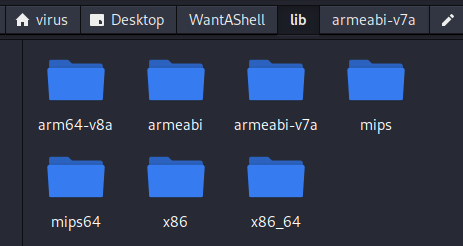
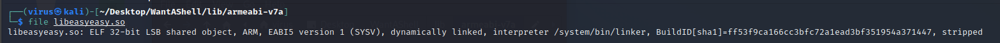
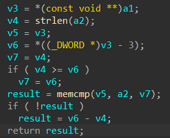
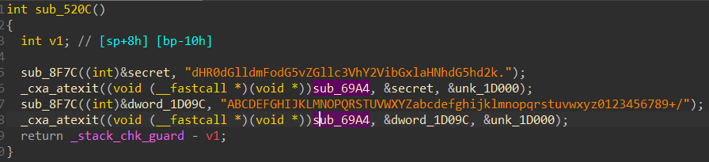
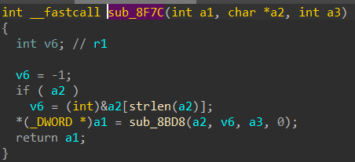
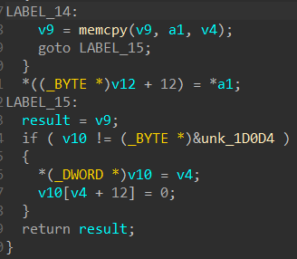
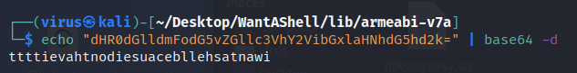

# WantAShell

## Analysis:

Chúng ta có 1 ứng dụng nhìn khá "rác": 

<p align="center"></p>

Nhập vào ô input mà không có nút submit đâu. Bấm tè le đâu đó ở góc phải dưới màn hình thì sẽ submit được ~.~

Mở file APK bằng **Jadx**. Đầu tiên, như một công việc pentest APK thường ngày, ta kiểm tra tổng quan file **AndroiManifest.xml**:

```xml
<?xml version="1.0" encoding="utf-8"?>
<manifest xmlns:android="http://schemas.android.com/apk/res/android" android:versionCode="1" android:versionName="1.0" package="com.example.ring.wantashell" platformBuildVersionCode="24" platformBuildVersionName="7">
    <uses-sdk android:minSdkVersion="19" android:targetSdkVersion="21"/>
    <application android:theme="@style/AppTheme" android:label="@string/app_name" android:icon="@mipmap/ic_launcher" android:allowBackup="true" android:supportsRtl="true">
        <activity android:name="com.example.ring.wantashell.MainActivity">
            <intent-filter>
                <action android:name="android.intent.action.MAIN"/>
                <category android:name="android.intent.category.LAUNCHER"/>
            </intent-filter>
        </activity>
    </application>
</manifest>
```

Activity chính của chương trình là **com.example.ring.wantashell.MainActivity**. Kiểm tra function activity, để ý đến hàm *onClick()*:

```java 
TextView textView = (TextView) MainActivity.this.findViewById(C0230R.C0232id.editText);
                MainActivity.this.this_is_your_flag = textView.getText().toString();
                if (MainActivity.this.this_is_your_flag.length() < 35) {
                    Process.killProcess(Process.myPid());
                } else if (MainActivity.this.this_is_your_flag.length() > 39) {
                    Process.killProcess(Process.myPid());
                }
                Format format = new Format();
                MainActivity.this.this_is_your_flag = format.form(MainActivity.this.this_is_your_flag);
                if (MainActivity.this.this_is_your_flag.length() < 32) {
                    Toast.makeText(MainActivity.this.getApplicationContext(), "No,more.", 1).show();
                    return;
                }
                Check check1 = new Check();
                boolean isflag = check1.check(MainActivity.this.this_is_your_flag);
                if (isflag) {
                    Toast.makeText(MainActivity.this.getApplicationContext(), "Congratulations!You got it.", 1).show();
                } else {
                    Toast.makeText(MainActivity.this.getApplicationContext(), "Oh no.Come on!", 1).show();
                }
```

Đoạn code trên có các điều kiện sau:
- Độ dài input < 35 hoặc > 39 => Thoát chương trình (kill Process)
- Độ dài input sau khi được gán lại giá trị trả về từ phương thức  `form` được định nghĩa tại class `Format` nhỏ hơn 32 thì popup lên message "No, more." :

```java
public String form(String input) {
        String pass = input.substring(5, 38);
        return pass;
    }

```

- Phần điều kiện quan trọng là check input có phải flag hay không:
  - Có => Popup lên message "Congratulations!You got it."
  - Không => Message "Oh no.Come on!" (Như ảnh mô tả tại giao diện android phía trên khi nhập 38 ký tự)

Ta cần phải nhập đúng input thỏa hàm `check` của class `Check`:

```java
public boolean check(String pass) {
        if (checkEmulator(this.emulator)) {
            return false;
        }
        return checkPasswd(pass);
    }
```

Hàm `check` sử dụng 2 hàm chính:

- `checkEmulator`: code sẽ xử lý và "làm gì đó" với "/dev/socket/qemud" và "/dev/qemu_pipe". Có một khái niệm là [QEMUD DAEMON](https://android.googlesource.com/platform/external/qemu/+/emu-master-dev/android/docs/ANDROID-QEMUD.TXT), đại khái cái này là một multiplexer daemon cho kênh truyền giữa thiết bị máy ảo và thật giao tiếp với nhau và cái này có một code template sẵn (tham khảo [tại đây](https://blog.birost.com/a?ID=00450-57aa0f6f-7979-427c-af1d-26722f272ced)) để kiểm tra thiết bị hiện tại đang chạy app là ảo hay thật. Nếu ảo => return false và không thỏa điều kiện => Chạy trên máy thật
- `checkPasswd`: thực hiện kiểm tra input có phải flag. Và vâng, lại là một hàm native :)) được import từ file `.so`. Vậy phải vào reverse file đó

```java
private native boolean checkPasswd(String str);
```

Dùng `unzip` command trên linux. Lấy full library :

<p align="center"></p>

Bài này đặc thù hơn mấy bài khác một tí. Thư viện native được build thành nhiều phiên bản cho việc tương thích nhiều architect của các CPU khác nhau (tham khảo [Androi ABIs](https://developer.android.com/ndk/guides/abis)). Ở đây theo mình nhìn sơ lược thì file thư viện trong **folder armeabi-v7a** dễ đọc nhất.

<p align="center"></p>

Mở bằng IDA 32-bit. Xem các function:

<p align="center"></p>

Vì file này được [biên dịch động](https://developer.android.com/training/articles/perf-jni) (dynamic) nên có hàm **JNI_Onload()**. Đồng thời cũng import sẵn một số hàm ta cần để phân tích. Ta không cần analysis hàm **JNI_Onload()**. Check hàm cần quan tâm `Java_com_example_ring_wantashell_Check_checkPasswd`. 

<p align="center"></p>

Hàm `checkPasswd` nhận 3 tham số, mặc dù chuỗi nhập vào là 1 input. Với việc decompile đoạn code như trên, tham số cuối là tham số đúng như định nghĩa (còn 2 tham số kia là 2 tham số môi trường để load hàm native) ta thấy chương trình xử lý 3 tham số cùng lúc và đưa vào biến `v6`

> NOTE: Đoạn này có thể bỏ qua

Tiếp theo, bỏ qua đoạn điều kiện `if ( v6 )` , nó không ảnh hưởng đến kết quả cuối. Xem xét tiếp đoạn code sau, phần này quyết định giá trị đầu ra:

<p align="center"></p>

Bỏ qua các dòng đầu. Ngay dòng cuối, `v12` sẽ được tạo ra bằng thuật toán nào đó thông qua hàm `encrypt` cùng biến `secret` làm đối sô.`v5` là giá trị trả về của hàm và cũng là giá trị trả về của `sub_7834`. Theo dõi hàm :

<p align="center"></p>

Và đầu ra hàm này là biến `result` *true* hoặc *false* phụ thuộc vào `memcmp` so sánh `v5` và `a2`. Trở về trước đó, `v5` nhận biến `secret` và `v2` nhận biến `v12`. Vậy ta cần tìm giá trị `secret` là xong:

<p align="center"></p>

`secret` xuất hiện trong code tại hàm `sub_520C`:

<p align="center"></p>

Ở đây ta thấy có một chuỗi "dHR0dGlldmFodG5vZGllc3VhY2VibGxlaHNhdG5hd2k." được đưa vào làm đối số cùng với biến `secret`, ta vào hàm `sub_8F7C` để xem tiếp chương trình thao tác như thế nào:

<p align="center"></p>

Vào tiếp hàm `sub_8BD8`:

<p align="center"></p>

Chương trình sẽ chạy theo luồng điều kiện như sau: `if (v6)` --> `LABEL_14` --> `LABEL_15`. Tại `LABEL_14`, hàm `memcpy` sẽ copy giá trị từ `a1` vào `v9` và `a1` nhận giá trị `char *a2` (tham số thứ 2 - cũng là chuỗi dài loằn ngoằn ở trên) làm đối số trước đó. Sau đó `v9` được đưa vào `result` cũng chính là giá trị trả về. 

Hay nói cách khác, quay lại hàm ban đầu `sub_520C` sẽ đưa chuỗi "dHR0dGlldmFodG5vZGllc3VhY2VibGxlaHNhdG5hd2k." vào `secret`. Nhìn một cách tổng thể, `checkPasswd` sẽ so sánh encrypted string `dHR0dGlldmFodG5vZGllc3VhY2VibGxlaHNhdG5hd2k.` với chuỗi input của chúng ta sau khi qua hàm `encrypt`. Hàm `encrypt` đọc khá rối, đến đây thì mình đoán thuật toán mã hóa vì chuỗi trên nhìn khá giống (rất giống) với *base64*, trong *base64* không có dấu chấm `.` vậy nên dấu cuối cùng là ký tự đệm `=`. Giải mã chuỗi này ra:

## Solution:

Decode:

<p align="center"></p>

Nhìn trông như một thông điệp, dịch ngược ký tự lại tại [Tex reverse](https://www.textreverse.com/):

<p align="center"></p>

> NOTE: Khi nhập vào app vẫn không nhận và thoát ra ngoài. Nhưng mình tham khảo wu trên cộng đồng thì đây đúng là flag.

Flag: **iwantashellbecauseidonthaveitttt**
