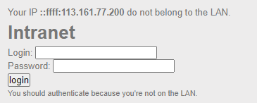

# HTTP - IP restriction bypass

**Point**: 10 Points

**Title**: Only local users will be able to access the page

**Description**:

Dear colleagues,

We’re now managing connections to the intranet using private IP addresses, so it’s no longer necessary to login with a username / password when you are already connected to the internal company network.

Regards,

The network admin

## Solution:

A website that requires to login with "login" and "password". The message indicates we are outside their network

<p align="center"> </p>

The description shows that we don't need to "login" if we have already been in their **local network**. There's a `Header` which specifies the ip of an incoming request `X-Forwarded-For`. As a result, we will "disguise" our real sent IP with our desired IP and we choose **private IP** to trick the targeted system.

Use `Burp Suite` to intercept requests. In the first request, add `X-Forwarded-For: 192.168.10.10` and then forward it.

> Note: Private IP address range (written down in the given references):

```
10.0.0.0        -   10.255.255.255  (10/8 prefix)
172.16.0.0      -   172.31.255.255  (172.16/12 prefix)
192.168.0.0     -   192.168.255.255 (192.168/16 prefix)
```

<p align="center"> </p>

Simple trick !!! 

Flag: **Ip_$po0Fing**