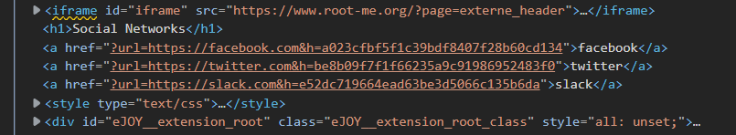

# HTML - HTTP - Open redirect

**Point**: 10 Points

**Title**: Internet is so big

## Solution:

We have website with 3 options.

<p align="center"> </p>

If we click on an item, the page will direct us to the page. Inspect the webpage to know where the page redirect us to:

<p align="center"> </p>

Try to change params `h` into something like `123` and access to the address

<p align="center"> </p>

We notice that the query executes with 2 params `url`: the URL we head to and `h` is a hash result of something. In this step, I just guess this hash is generated from URL, but I don't know what type of hash. So I calculate the **URL** with most popular kinds of hash, I use [this website](https://www.browserling.com/tools/all-hashes).

Use the default `?url=https://facebook.com&h=a023cfbf5f1c39bdf8407f28b60cd134` to determine which hash function has been used

==> Then we know the hash function is **MD5**.

Try another website, example: https://www.youtube.com with calculated hash:

```
?url=https://www.youtube.com&h=d245406cb6c9f36be9064c92c34e12e1
```

Our goal is to redirect to somewhere that could make compromise to the server on this website. Now, I make another guess with domain `http://localhost` and our generated hash `

In this step, I use **Burp Suite** as the webpage will redirect quite fast and we could miss our flag. Trust me :))

```
?url=http://localhost&h=86a9106ae65537651a8e456835b316ab
```

<p align="center"> </p>

Flag: **e6f8a530811d5a479812d7b82fc1a5c5**