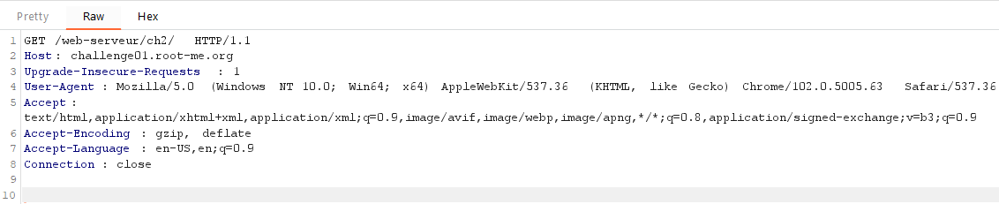
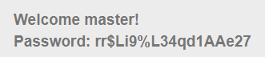

# HTTP - User-agent

**Point**: 10 Points

**Title**: Admin is really dumb...

## Solution:

We have a page with clear message.

 

Now we use **Burp Suite** to intercept request  

 

Change `User-Agent` to `admin` browser.

 

Really straightforward. Isn't it?

Flag: **rr$Li9%L34qd1AAe27**