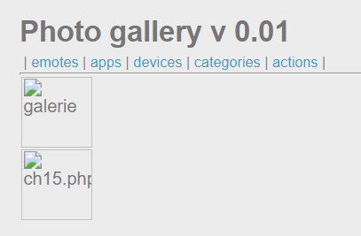
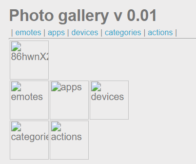
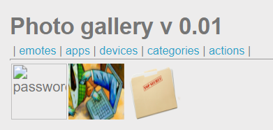
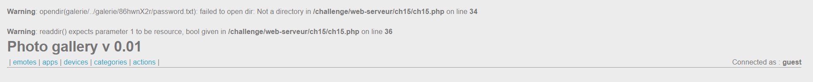
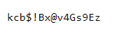

# Directory traversal

**25 Points - Medium**

**Title:**

Photo gallery v 0.01

**Statement**

Find the hidden section of the photo galery.

## Solution:

Ta có một ứng dụng web về kho ảnh và tùy chọn xem các mục :

<p align="center">  </p>

Đây là một bài **Directory traversal** nên đầu tiên ta sẽ tìm cách "nhảy tới nhảy lui" đường dẫn file. Ở đây có một input point thích hợp để "làm chuyện đó" là tại tham số `galerie`. Thử giá trị `..`:

<p align="center">  </p>

Vậy là ta có thể thực hiện **traversal** thành công. Ta có thể thấy ở trên đang ở *thư mục gốc của ứng ụng* (có chứa file `ch15.php` - file xử lý backend chính cho chall này)

> NOTE: Những folder và file không đúng định dạng ảnh sẽ không render ra được.

Vào thư mục `galerie`. Payload:

```
?galerie=../galerie
```

<p align="center">  </p>

Mấy folder khác chắc cú là folder ảnh rồi. Ở đây có một folder đáng chú ý là `86hwnX2r`. Vào xem thử :

```
?galerie=../galerie/86hwnX2r
```

> NOTE: Xem đầy đủ tên folder bằng `Developer tools`

<p align="center">  </p>

Yesss ! Ta thấy có file `password.txt`. Đọc bằng biến `galerie`:

```
?galerie=../galerie/86hwnX2r/password.txt
```



Hơi sai tí @.@ . File `ch15.php` sử dụng hàm `opendir()` để mở thư mục và vì đây là file **.txt** nên không thể thực hiện, kéo theo hàm đọc nội dung folder `readdir()` cũng bị lỗi. Vậy ta không có cách đọc file ??

Dễ thôi, mình sẽ truy cập vào nội dung file bằng URL. Ta thấy vị trí của `password.txt` là `/galerie/86hwnX2r/password.txt`, ta đang ở *thư mục gốc ứng dụng* như ta đã đi lần lượt từ gốc đến ngọn ở trên. URL cần tìm: 

```
http://challenge01.root-me.org/web-serveur/ch15/galerie/86hwnX2r/password.txt
```

<p align="center">  </p>

Flag: **kcb$!Bx@v4Gs9Ez**