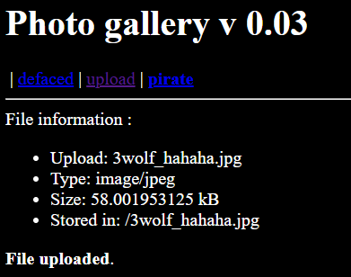
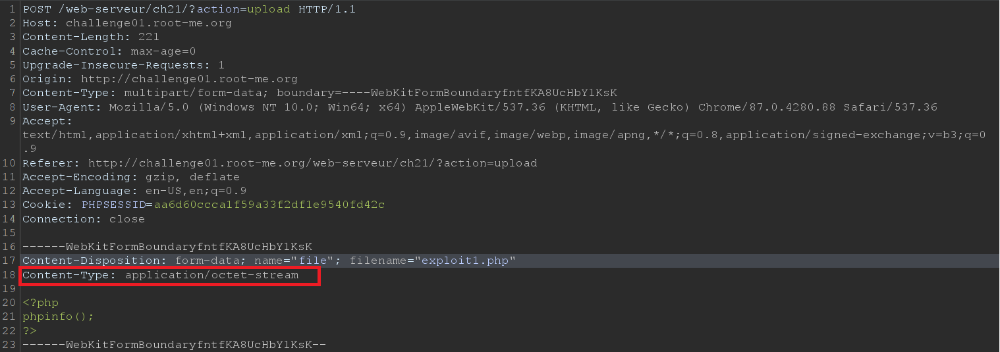
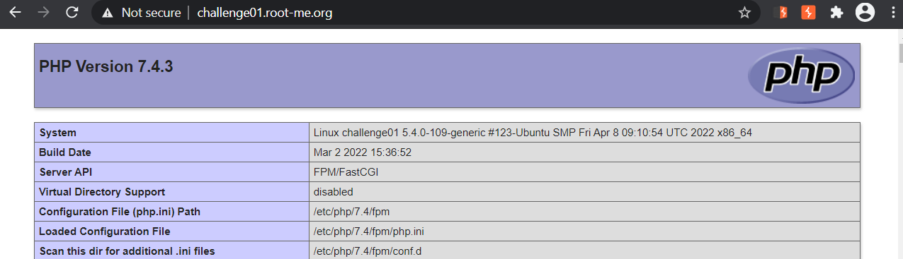
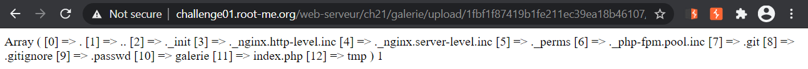
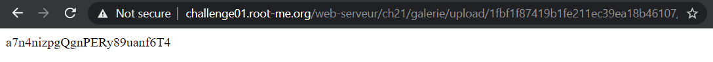

# File upload - MIME type

**20 Points - Easy**

**Gallery v0.03**

**Statement**

Your goal is to hack this photo galery by uploading PHP code.<br>
Retrieve the validation password in the file .passwd.

## Analysis:

Lại một trang web với chức năng upload ảnh. Thử upload một ảnh bất kỳ `3wolf_hahaha.jpg`:

<p align="center"></p>

Trở lại trang `upload`, xem ảnh thấy cũng bình thường. Đầu tiên thì ta luôn nhìn vào tiêu đề bài để phân tích. [`MIME type`](https://developer.mozilla.org/en-US/docs/Web/HTTP/Basics_of_HTTP/MIME_types) là một trường để chỉ ra format của một tài liệu (document), một image, một file nội dung, ... được định nghĩa bởi IETF's [RFC 6838](https://datatracker.ietf.org/doc/html/rfc6838). Tham khảo [Các loại MIME đang được hỗ trợ](https://www.iana.org/assignments/media-types/media-types.xhtml) 

Bài này để solve được, nên đọc [document](https://repository.root-me.org/Exploitation%20-%20Web/EN%20-%20Secure%20file%20upload%20in%20PHP%20web%20applications.pdf) tại **trang 6-7**. Ở đây, người ta chỉ ra rằng chúng ta có thể upload file PHP lên server cho dù định dạng đuôi (extension) không đúng, server sẽ kiểm tra `Content-Type` của request mà chúng ta **POST** file lên có phải là một trong `image/png` hoặc `image/gif` , ... . Do đó, một cách đánh lừa bên server là mình sẽ chỉnh lại trường này. 

## Solution:

Để tiện việc chặn và thay đổi request, mình dùng `Burpsuite`. Chuẩn bị một file `exploit1.php` với nội dung:

```php
<?php
phpinfo();
?>
```

Upload file lên và lấy request **POST** :

<p align="center"></p>

Thay đổi `Content-Type` ở trên từ `application/octet-stream` thành `image/png` (đúng định dạng ảnh). *Forward* request đi:

<p align="center"></p>

Vậy là mình đã bypass được việc upload file PHP, ảo trưa ? . Vào chỗ lưu ảnh xem thử code PHP có được thực thi :

<p align="center"></p>

OK. Giờ mình phải đọc file `.passwd` (khả năng cao là nằm trong *thư mục root của ứng dụng*), để cho chắc thì mình xem thư mục gốc này có không đã (do đề không nói rõ hint như mấy bài khác). Đường dẫn tại nơi file được lưu giữ `http://challenge01.root-me.org/web-serveur/ch21/galerie/upload/aa6d60ccca1f59a33f2df1e9540fd42c//exploit1.php`, vậy mình sẽ lùi lại từ folder `upload` đến *thư mục root* là `../../../` (lùi 3 lần). Đổi payload code PHP với nội dung sau và thực hiện đổi **header** tương tự như trên:

```php
<?php
echo print_r(scandir("../../../"));
?>
```

<p align="center"></p>

All right. Vậy là thấy có file `.passwd` . Đọc file này ra, code:

```php
<?php
echo file_get_contents("../../../.passwd");
?>
```

<p align="center"></p>

Flag: **a7n4nizpgQgnPERy89uanf6T4**
