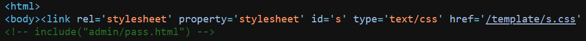
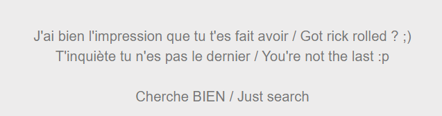
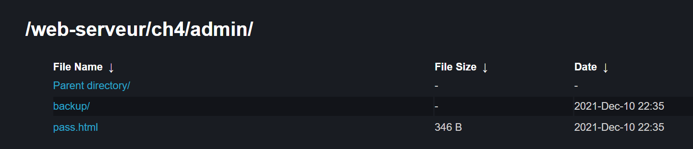
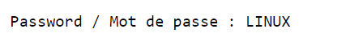

# HTTP - Directory indexing

**15 Points**

**Title**

CTRL+U...

## Solution:

Challenge này khá easy. **HTTP - Directory indexing** nói về việc để lộ thông tin chứng thực khi người dùng "giao tiếp" với hệ thống server của file. Trong trường hợp này theo như tiêu đề gợi ý thì là source code (Ctrl + U), kiểm tra thử:

<p align="center"> </p>

Ta thử vào đường dẫn `admin/pass.html`. Full URL: 

```
http://challenge01.root-me.org/web-serveur/ch4/admin/pass.html
```

<p align="center"> </p>

Đây không phải password, mình đi nhầm hướng rồi. Thử kiểm tra thư mục `admin/`. URL:

```
http://challenge01.root-me.org/web-serveur/ch4/admin/
```

<p align="center"> </p>

Có một đường dẫn khác tại folder `backup/`, vào đó thấy file `admin.txt`. URL:

```
http://challenge01.root-me.org/web-serveur/ch4/admin/backup/admin.txt
```
<p align="center"> </p>

Ta có được password. Xong !

Flag: **LINUX**