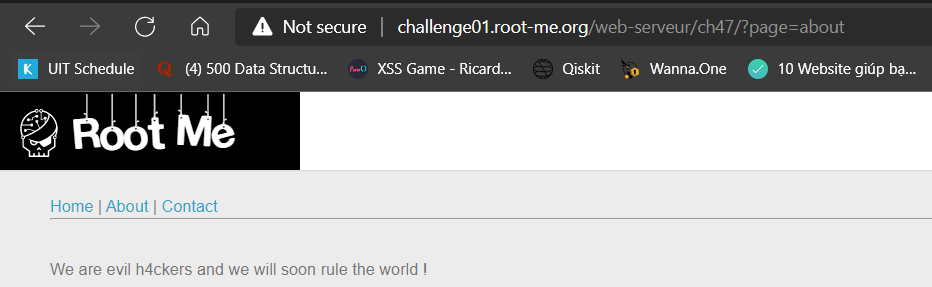
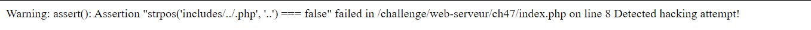
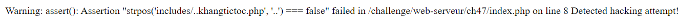
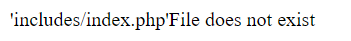
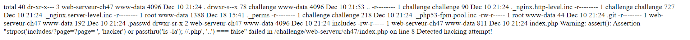
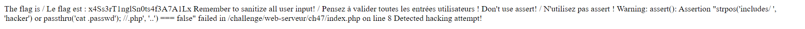

# PHP - assert()

**25 Points - Medium**

**Read the doc!**

**Statement**

Find and exploit the vulnerability to read the file .passwd.

## Analysis:

Ta có một website với chức năng hiển thị nội dung và chuyển trang. Ta dễ dàng nhận ra input point là biến `page` của URL

<p align="center">  </p>

Thử fuzzing biến `page` với các ký tự lạ như `../`

<p align="center">  </p>

> NOTE: Trước khi đi vào bài thì ta phải biết hàm [assert()](https://www.php.net/manual/en/function.assert.php). Đây là một câu lệnh giúp debug các câu điều kiện, trả về **true** hoặc **false**. Chú ý ở phiên bản 8.0+ thì biểu thức không cần đưa vào dấu nháy kép `""`.

Ta thử nhiều giá trị khác nhau và dễ dàng nhận ra giá trị ta input vào biến `page` sẽ được được vào tại vị trí như sau và chuỗi so sánh luôn là `'..'`:

(Minh họa phía backend)

```php
if(isset($_GET['page'])){
    $param = $_GET['page'];
}
else {
    $param = 'home';
}

$include = "includes/". $param . ".php";
assert("strpos($include, '..') === false") or die("Detected hacking attempt!");

```

Với việc đưa thẳng giá trị ta nhập vào rồi nối chuỗi (concatenate) , sau đó đưa vào lệnh như vậy (bất kỳ lệnh nào, trong trường hợp này là `assert`) thì rất nguy hiểm, ta có thể *escape* code rồi thực hiện command mà ta muốn. Với bài trên, sẽ thấy có 2 luồng xử lý:

- Trường hợp `false`: Set giá trị cho `page` là `..khangtictoc` thì `..` sẽ nằm trong chuỗi -> `strpost` return **true** -> `assert` return **false** -> In ra thông điệp như cũ:

<p align="center">  </p>

- Trường hợp `true`: Set giá trị cho `page` là `index` thì `..` sẽ không nằm trong chuỗi -> `strpost` return **false** -> `assert` return **true** -> In ra thông điệp như sau:

<p align="center">  </p>

## Solution:

Vậy là ta chỉ cần *escape* khỏi assert và thực hiện tương tự đoạn code trên, thay `or die("Detected hacking attempt!");` thành câu lệnh ta muốn, ở đây mình sẽ thực thi shell cho gọn (vì mình thử và thấy chall không cấm :v) `or passthru('ls');`. Ở đây vì file  `.passwd` sẽ là file ẩn nên mình thêm tùy chọn `-la`, sau đó comment `//` hết phần ở sau lại. Payload:

```
?page= ', 'hacker') or passthru('ls -la'); // 
```

<p align="center">  </p>

Ta thấy có file `.passwd` ở đường dẫn hiện tại luôn (cố căng mắt nhìn :> ). Giờ đọc file ra:

```
?page= ', 'hacker') or passthru('cat .passwd'); // 
```

<p align="center">  </p>

Flag: **x4Ss3rT1nglSn0ts4f3A7A1Lx**